# Reporte de Laboratorio: Seguridad en FortiGate

  <h1>Instituto Tecnológico de Las Américas (ITLA)</h1>
   
  <h2>Tema: Configuración de Políticas de Seguridad, Filtrado Web, Control de Aplicaciones, DoS y WAF en FortiGate</h2>
    
  
<strong>Estudiante:</strong> Alan Daniel Garcia Mendez

  
<strong>Matrícula:</strong> 2025-1403

  
<strong>Carrera:</strong> Seguridad Informática

  
<strong>Asignatura:</strong> Seguridad de Redes

  
<strong>Docente:</strong> Jonathan Esteban Rondon Corniel

  
<strong>Fecha de entrega:</strong> 9 de julio de 2026

  
<strong>Enlace del video:</strong> <a href="https://youtu.be/mp1y5AXqenU">https://youtu.be/mp1y5AXqenU</a>

  
<strong>Enlace del repositorio:</strong> <a href="https://github.com/imAlanG16/laboratorio-seguridad-fortigate">https://github.com/imAlanG16/laboratorio-seguridad-fortigate</a>

## 1. Introducción

El presente informe detalla el proceso de implementación de políticas de seguridad avanzadas en un firewall FortiGate (versión 7.0.3) simulado en un entorno de laboratorio. Se cubren la segmentación de red, enrutamiento estático, servicios DHCP, filtrado web, control de aplicaciones y mecanismos de protección activa como la mitigación de escaneos de red (antiscanner DoS) y el Web Application Firewall (WAF) aplicados a un servidor web de producción interno.

## 2. Topología de Red

La topología está diseñada en PNetLab y consta de los siguientes componentes principales:
*   **FortiGate**: Actúa como el dispositivo perimetral que segmenta y asegura el tráfico entre las zonas.
*   **WAN (port1)**: Conexión externa con acceso a Internet para la salida de los clientes.
*   **LAN de Usuarios (port3 - Clientes)**: Segmento de red `/25` destinado a las estaciones de trabajo de los usuarios (dirección IP de interfaz `14.3.10.1/25`).
*   **LAN de Servidores (port2 - Servidores)**: Segmento de red `/28` destinado a alojar servicios críticos, incluido el servidor web (dirección IP de interfaz `14.3.50.1/28`).
*   **Servidor Web**: Máquina Linux/Windows ejecutando un servidor web HTTP básico en el puerto 80.
*   **Estación LAN de Usuarios**: Cliente virtual de prueba para verificar navegación y restricciones.

  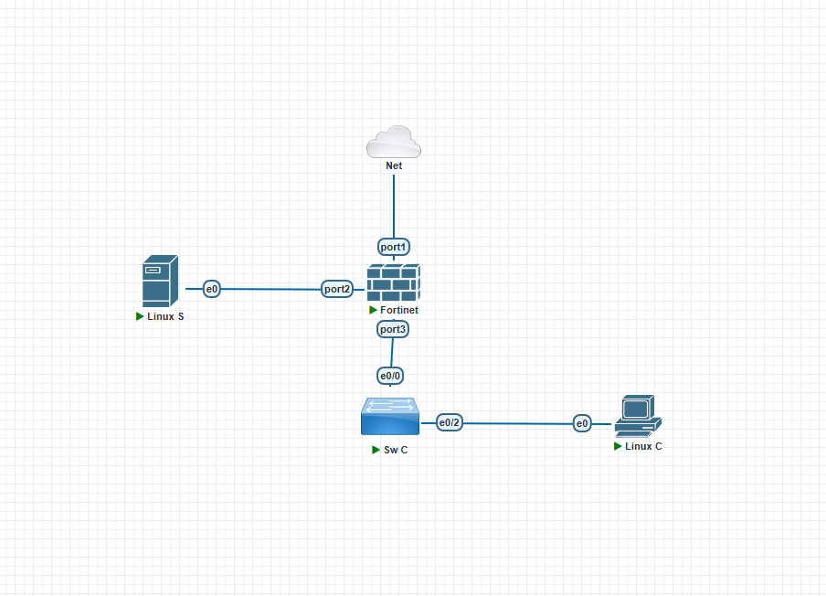
  
<em>Figura 1: Topología de Red en PNetLab</em>

## 3. Configuración de Interfaces y Servicios

### 3.1 Interfaces de Red
Se configuraron las direcciones IP estáticas en las interfaces del FortiGate correspondientes a los requisitos del laboratorio:
*   **port3 (Clientes - LAN de Usuarios)**: `14.3.10.1/25`
*   **port2 (Servidores - LAN de Servidores)**: `14.3.50.1/28`

  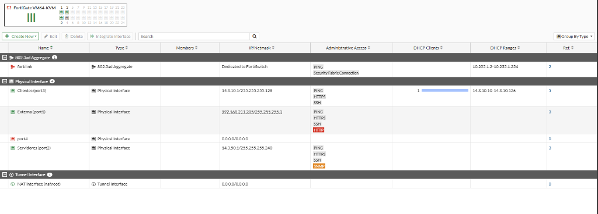
  
<em>Figura 2: Interfaces de red configuradas en FortiGate</em>

### 3.2 Servidor DHCP
Se habilitó un servidor DHCP en el **Port 2** para la asignación dinámica de direcciones IP a los dispositivos en el segmento de usuarios, delimitando el pool para la subred de usuarios.

  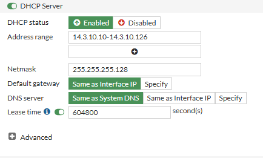
  
<em>Figura 3: Servidor DHCP configurado para la LAN de usuarios</em>

### 3.3 Ruta por Defecto
Para permitir la conectividad hacia el exterior, se creó una ruta estática apuntando a la dirección IP del Gateway del proveedor de servicios (ISP) a través del Port 1 (WAN).

  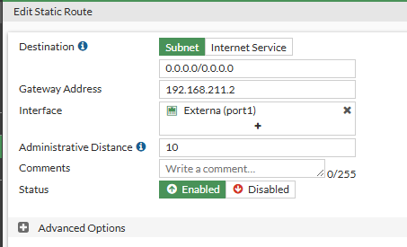
  
<em>Figura 4: Ruta estática por defecto hacia el Gateway WAN</em>

## 4. Políticas de Seguridad e Inspección

### 4.1 Permitir Tráfico HTTP de Usuarios a Servidores
Se configuró una política para restringir toda comunicación entre la LAN de usuarios y la LAN de servidores, permitiendo únicamente el tráfico web HTTP (Puerto 80). Se definió el origen como la LAN de usuarios, destino como la LAN de servidores, estableciendo el servicio como **HTTP** y la acción en **Accept**, bloqueando implícitamente cualquier otro tipo de tráfico o puertos como ICMP o SSH.

  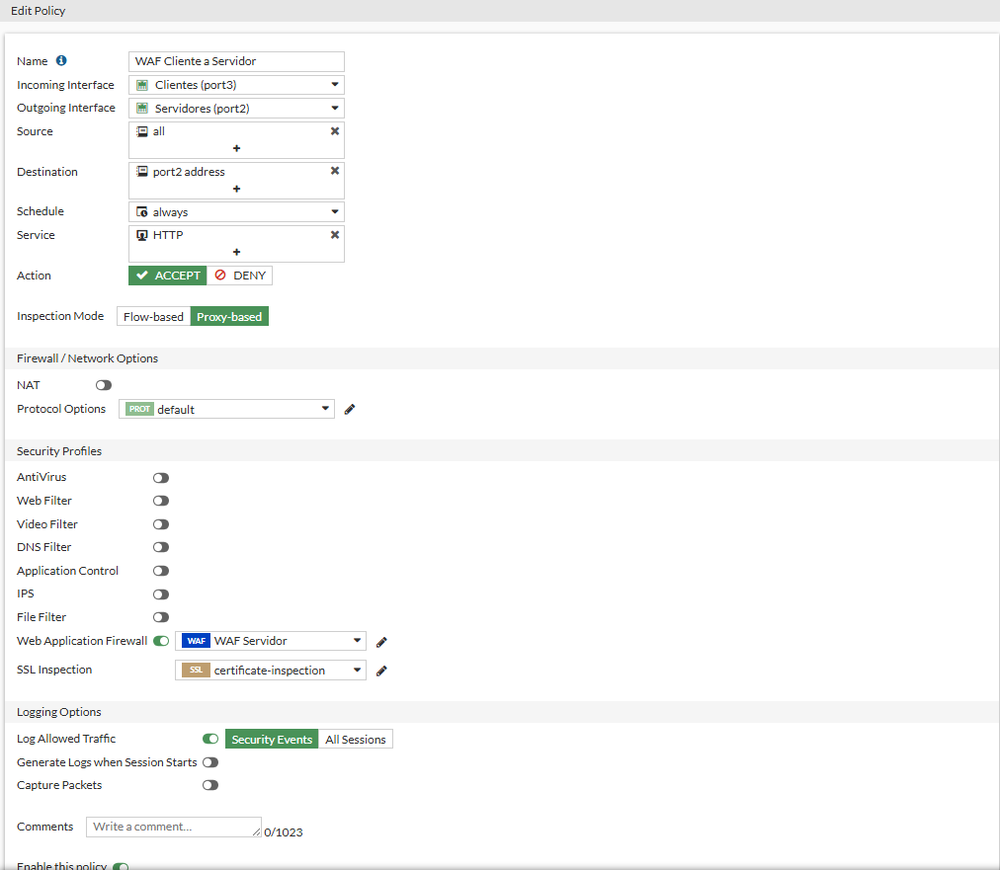
  
<em>Figura 5: Política de cortafuegos de Usuarios a Servidores</em>

### 4.2 Política de Salida General (NAT Clientes)
Para permitir que los clientes de la LAN de usuarios accedan a Internet con traducción de direcciones y al mismo tiempo tengan aplicados los perfiles de control correspondientes, se creó la política IPv4 general llamada **NAT Clientes** (con origen `Clientes (port3)` y destino `all`).

  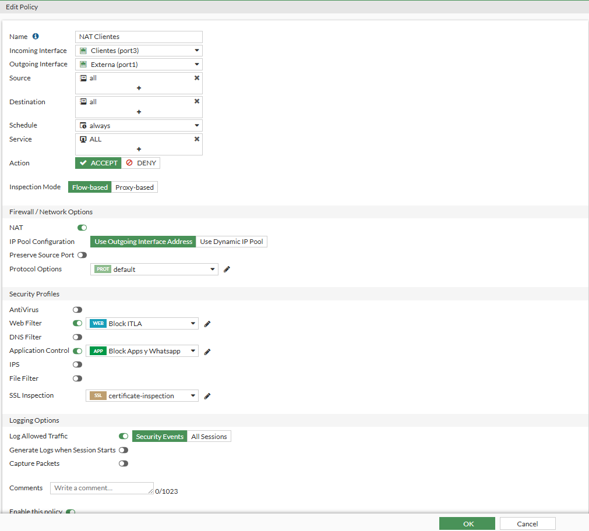
  
<em>Figura 6: Política NAT Clientes con perfiles de seguridad aplicados</em>

### 4.3 Configuración del Filtrado Web (Web Filter)
Para bloquear el acceso a redes sociales y dominios locales se aplicó un perfil de Web Filter a la regla de salida general:
*   **Bloqueo de Categorías**: Se bloqueó la categoría "Social Media" (Redes Sociales) en el FortiGuard Category Filter para evitar el acceso a plataformas como Facebook o Instagram.
*   **Filtro URL Personalizado**: Se ingresó el patrón `*itla.edu.do` configurado con acción **Block** y tipo comodín para denegar cualquier subdominio o página relacionada a la institución.

  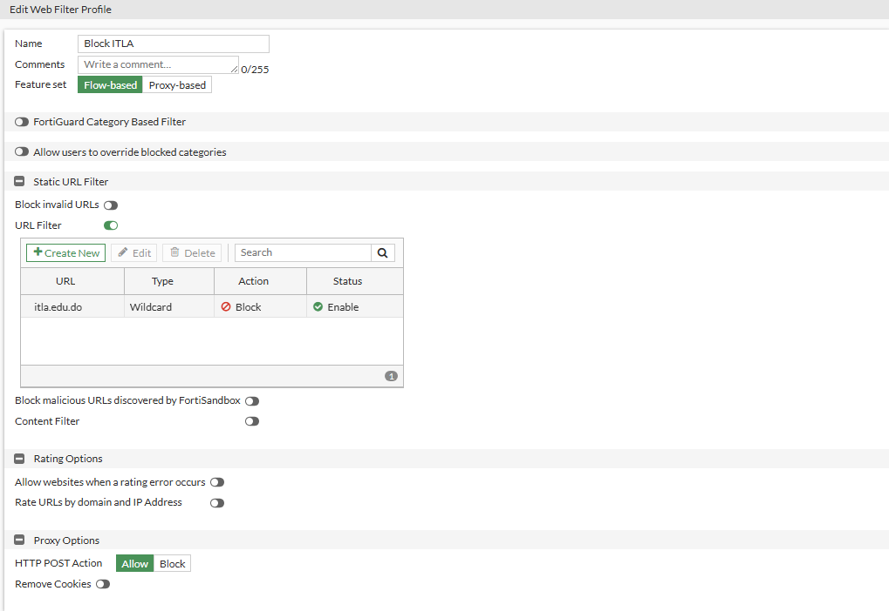
  
<em>Figura 7: Perfil de Filtrado Web y Filtro URL de ITLA</em>

### 4.4 Control de Aplicaciones (Application Control)
Para cumplir con el bloqueo de llamadas y uso de la aplicación WhatsApp, se habilitó la inspección de aplicaciones en la política de salida general de los usuarios, agregando la firma de **WhatsApp** con acción **Block**.

  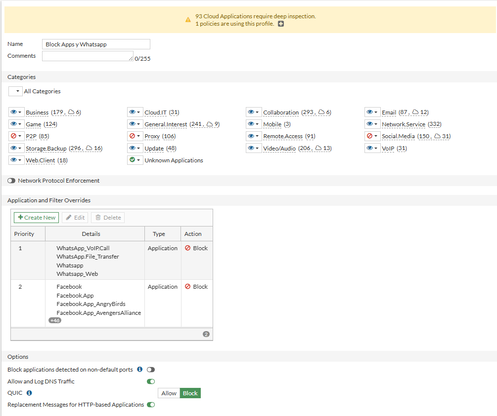
  
<em>Figura 8: Regla de bloqueo de WhatsApp en Application Control</em>

## 5. Mitigación de Amenazas (DoS y WAF)

### 5.1 Configuración Antiscanner (DoS Anomaly)
Se configuró una política DoS (Denial of Service) en la interfaz LAN de usuarios para detectar escaneos de puertos rápidos como los realizados por la herramienta Nmap:
*   Se configuró un **Threshold** (umbral de paquetes por segundo) para anomalías de tipo escaneo TCP/UDP.
*   Al superarse el umbral establecido de conexiones en corto tiempo, el FortiGate bloquea temporalmente al atacante, aplicando la acción de descartar o cerrar las sesiones de manera inmediata (`clear_session` / `block`).

  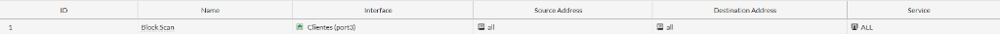
  
<em>Figura 9: Política DoS e IPS configurada contra escaneos de red</em>

### 5.2 Web Application Firewall (WAF)
Se activó el WAF en el FortiGate y se aplicó un perfil de seguridad a la política HTTP de acceso al servidor. El WAF se encarga de analizar las peticiones entrantes buscando firmas de ataques del OWASP Top 10, tales como SQL Injection (SQLi) o Cross-Site Scripting (XSS), interceptando y bloqueando la conexión al detectar contenido malicioso.

  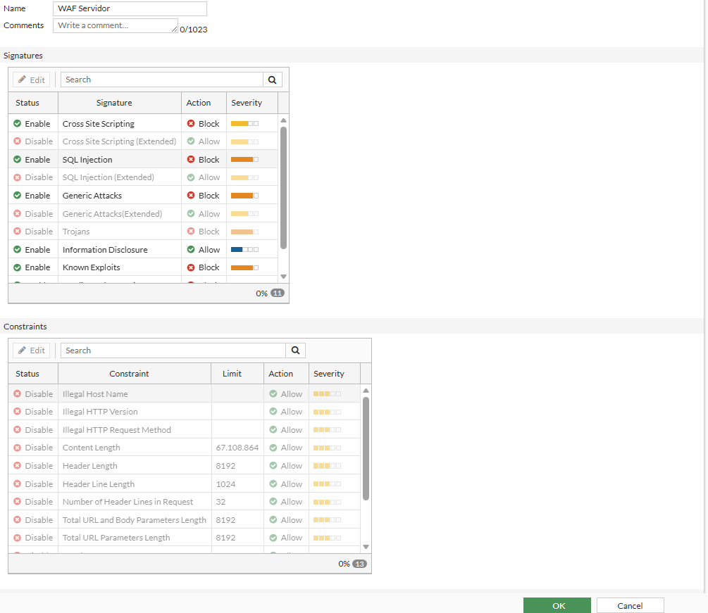
  
<em>Figura 10: Perfil WAF configurado y aplicado a la política del servidor web</em>

## 6. Pruebas de Funcionamiento y Evidencias

### 6.1 Pruebas de Filtro Web y Aplicaciones (Redes Sociales e ITLA)
Desde la máquina cliente en la LAN de usuarios, se intentó ingresar a páginas de redes sociales (Pinterest) y al dominio del ITLA. El FortiGate interceptó y bloqueó las conexiones aplicando las políticas Web Filter y Application Control.

  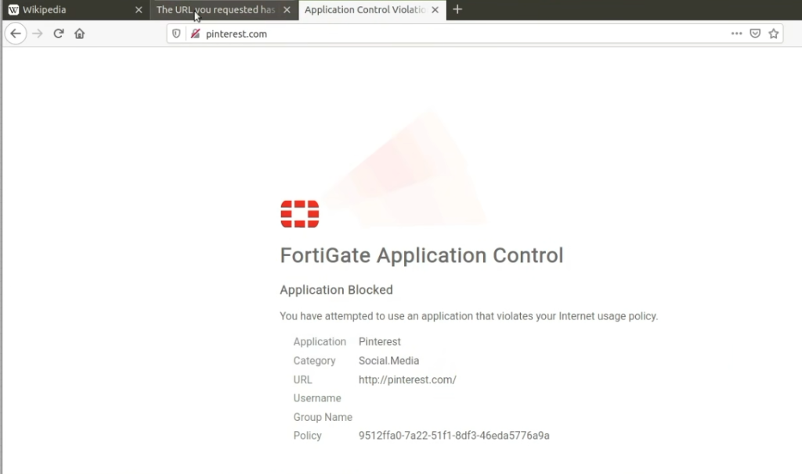
  
<em>Figura 11: Bloqueo de la plataforma Pinterest por políticas de control de aplicaciones en el navegador</em>

Al intentar ingresar al dominio del ITLA, la pantalla de bloqueo de FortiGuard se despliega de inmediato.

  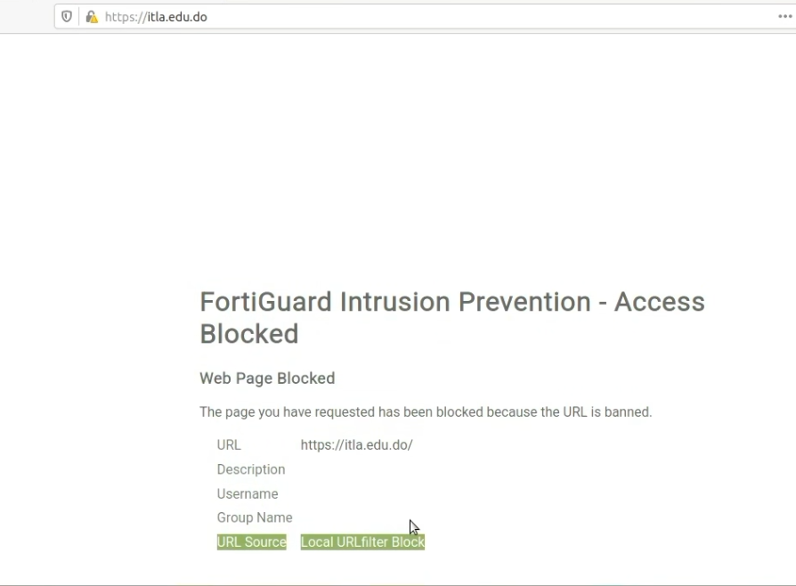
  
<em>Figura 12: Pantalla de bloqueo de FortiGuard en el navegador al intentar acceder a itla.edu.do</em>

Asimismo, en el registro de tráfico web del FortiGate se documentó el bloqueo de la sesión hacia el dominio del ITLA desde la IP del cliente `14.3.10.10`.

  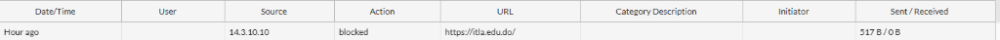
  
<em>Figura 13: Registro de logs del Web Filter mostrando el estado "blocked" para la petición de itla.edu.do</em>

### 6.2 Evidencia de Mitigación Antiscanner (Nmap)
Se ejecutó un escaneo de puertos TCP rápido (nmap -sS) desde el cliente hacia la dirección IP del Gateway del FortiGate (`14.3.10.1`). En la consola del cliente se observa cómo el escaneo comienza a sufrir demoras y caídas de paquetes debido a la intervención del firewall.

  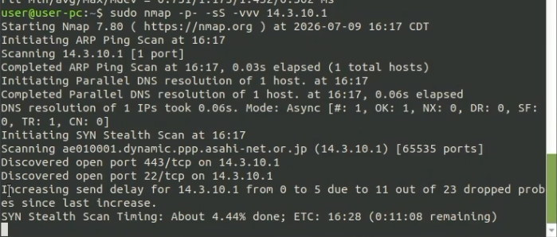
  
<em>Figura 14: Terminal del cliente documentando el incremento de retraso de envío por pérdida de sondeos</em>

Los registros de la política DoS en el FortiGate muestran cómo el motor de seguridad identificó la anomalía `tcp_port_scan` y cortó las conexiones de inmediato mediante la acción `clear_session`.

  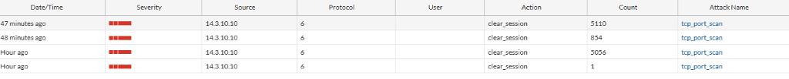
  
<em>Figura 15: Registros DoS Anomalies en FortiGate documentando la acción clear_session contra el escaneo</em>

### 6.3 Evidencia de Bloqueo del WAF
Se simuló un ataque de Directory Traversal (`../../../../`) en la URL para intentar leer directorios del sistema en el servidor web. La petición fue interceptada en el navegador por la firma de seguridad del WAF de FortiGate, impidiendo que el ataque llegara al servidor web.

  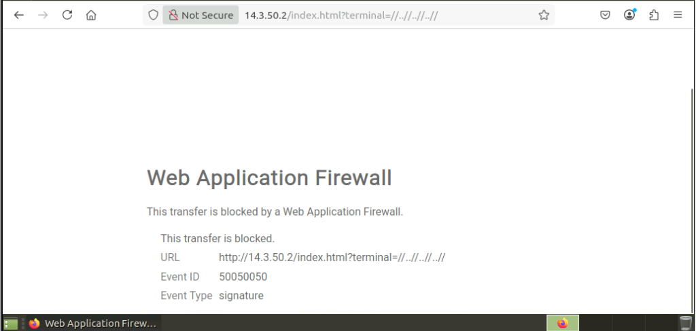
  
<em>Figura 16: Mensaje de bloqueo del Web Application Firewall al interceptar el intento de inyección de directorios</em>

## 7. Conclusión
El laboratorio demuestra la efectividad de las soluciones UTM y perfiles de seguridad UTM de FortiGate para proteger las redes internas tanto de amenazas basadas en la navegación web de usuarios (Application Control, Web Filter) como de ataques dirigidos contra la infraestructura interna (DoS Policy, WAF).